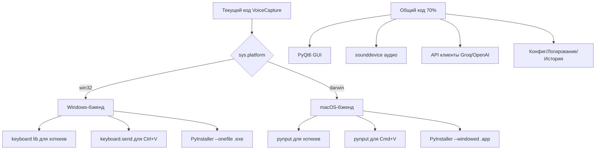

# Анализ портирования VoiceCapture на macOS

## Краткий ответ

**Да, приложение можно собрать для Mac, но потребуется существенная доработка.** Около 70% кодовой базы кроссплатформенна (PyQt6, sounddevice, API-клиенты), но есть 3 критических блокера и несколько умеренных проблем.

---

## Анализ совместимости по модулям

### ✅ Полностью кроссплатформенные модули (работают без изменений)

| Модуль          | Файл                                                                                 | Статус                                               |
| --------------- | ------------------------------------------------------------------------------------ | ---------------------------------------------------- |
| GUI (основа)    | `src/ui/floating_window.py`, `src/ui/settings_dialog.py`, `src/ui/history_dialog.py` | PyQt6 — кроссплатформенный                           |
| Системный трей  | `src/ui/system_tray.py`                                                              | QSystemTrayIcon работает на macOS                    |
| Запись аудио    | `src/audio/recorder.py`                                                              | sounddevice использует PortAudio — работает на macOS |
| API-клиенты     | `src/recognition/groq_api.py`, `src/recognition/openai_api.py`                       | HTTP-запросы — кроссплатформенны                     |
| Постобработка   | `src/recognition/postprocessor.py`                                                   | Чистый Python                                        |
| Обработка аудио | `src/utils/audio_processing.py`                                                      | numpy — кроссплатформенный                           |
| Конфиг          | `src/config/settings.py`                                                             | PyYAML + pathlib — кроссплатформенны                 |
| Логирование     | `src/utils/logger.py`                                                                | loguru — кроссплатформенный                          |
| История         | `src/utils/history.py`                                                               | Чистый Python                                        |
| Восстановление  | `src/utils/recovery.py`                                                              | Чистый Python + pathlib                              |

### 🔴 Критические блокеры (требуют переписывания)

#### 1. Библиотека `keyboard` — горячие клавиши

**Файлы:** [`hotkey_manager.py`](src/hotkey/hotkey_manager.py:1)

**Проблема:** Библиотека `keyboard` на macOS **требует root-права** (`sudo`) для работы, так как использует низкоуровневый перехват клавиатуры через `/dev/input`. Это делает её непригодной для обычного десктопного приложения.

Кроме того, в коде используются Windows-специфичные клавиши:
- `left windows` / `right windows` — на Mac это клавиша `Command` (⌘)
- Комбинация `ctrl+win` → на Mac должна стать `ctrl+cmd` или `cmd+ctrl`

**Решение:** Заменить `keyboard` на `pynput` (уже есть в `requirements.txt`!) для перехвата горячих клавиш. `pynput` корректно работает на macOS через Accessibility API (требует разрешение в System Preferences → Security & Privacy → Accessibility, но не root). Альтернатива — использовать встроенные горячие клавиши Qt через `QShortcut` / `QAction` с `QGlobalShortcut` (но глобальные шорткаты в Qt6 требуют дополнительной библиотеки).

#### 2. Библиотека `keyboard` — автовставка (Ctrl+V)

**Файл:** [`clipboard_manager.py`](src/clipboard/clipboard_manager.py:60)

**Проблема:** `keyboard.send("ctrl+v")` — на macOS вставка делается через `Cmd+V`, а не `Ctrl+V`. Плюс те же ограничения root.

**Решение:** Использовать `pynput` для эмуляции нажатий клавиш, или `subprocess.run(["osascript", "-e", "..."])` для AppleScript-вставки, или `pyautogui`. На macOS нужно отправлять `Cmd+V`.

#### 3. Скрипт сборки — PyInstaller

**Файл:** [`build_exe.py`](build_exe.py:1)

**Проблема:**
- `--add-data=assets;assets` — разделитель `;` работает только на Windows. На macOS/Linux нужен `:`
- `--hidden-import=pynput.keyboard._win32` и `pynput.mouse._win32` — это Windows-бэкенды
- `--noconsole` — на macOS используется `--windowed`
- На macOS результат — `.app` bundle, а не `.exe`

**Решение:** Создать платформозависимый `build_exe.py` с условной логикой (`sys.platform`).

### 🟡 Умеренные проблемы (требуют небольших правок)

#### 4. Зависимость `pyaudio`

**Файл:** [`requirements.txt`](requirements.txt:6)

**Проблема:** `pyaudio==0.2.13` может быть сложно установить на macOS — требуется PortAudio через `brew install portaudio` перед `pip install pyaudio`. Впрочем, в коде используется `sounddevice`, а не `pyaudio` напрямую — возможно, `pyaudio` вообще не нужен и это артефакт.

#### 5. Клавиша Win → Command

**Файл:** [`hotkey_manager.py`](src/hotkey/hotkey_manager.py:182)

**Проблема:** Хоткей по умолчанию `ctrl+win` — на macOS нужно заменить на `ctrl+cmd` или аналог. Также `left windows`/`right windows` в обработчике release → `left command`/`right command`.

#### 6. BAT-файл запуска

**Файл:** [`start_voicecapture.bat`](start_voicecapture.bat)

**Проблема:** `.bat` — Windows-only. Нужен `.sh` скрипт для macOS.

#### 7. macOS Accessibility Permissions

**Проблема:** На macOS приложение должно запрашивать разрешение Accessibility для:
- Глобальных горячих клавиш
- Эмуляции нажатий клавиш (вставка)
Пользователю придётся вручную дать разрешение в System Preferences.

---

## Архитектура решения

---

## План портирования

### Этап 1: Абстракция платформозависимого кода

1. Создать абстрактный интерфейс `PlatformHotkeyBackend` с методами `start()`, `stop()`, `register_hotkey()`, `on_key_release()`
2. Реализовать `WindowsHotkeyBackend` (текущий код с `keyboard`)
3. Реализовать `MacOSHotkeyBackend` (на `pynput`)
4. В `HotKeyManager` выбирать бэкенд по `sys.platform`

### Этап 2: Кроссплатформенный ClipboardManager

1. Создать абстракцию для автовставки
2. Windows: `keyboard.send("ctrl+v")` (текущий код)
3. macOS: `pynput` с `Key.cmd + "v"` или AppleScript

### Этап 3: Маппинг клавиш

1. Создать словарь маппинга: `win` → `cmd` на macOS
2. Дефолтный хоткей на macOS: `ctrl+cmd` вместо `ctrl+win`
3. Обновить `config/settings.py` для платформозависимых дефолтов

### Этап 4: Сборка для macOS

1. Обновить `build_exe.py` с условной логикой для macOS
2. Разделитель `--add-data`: `:` вместо `;`
3. Hidden imports: `pynput.keyboard._darwin` и `pynput.mouse._darwin`
4. Флаг `--windowed` вместо `--noconsole`
5. Создать `start_voicecapture.sh`

### Этап 5: Тестирование и UI

1. Проверить QSystemTrayIcon на macOS (особенности menubar)
2. Проверить позиционирование floating window
3. Добавить инструкцию по выдаче Accessibility permission
4. Проверить pyaudio — убрать из requirements если не используется

---

## Оценка сложности

| Компонент                          | Изменения                                           |
| ---------------------------------- | --------------------------------------------------- |
| `hotkey_manager.py`                | Значительное переписывание — новый бэкенд на pynput |
| `clipboard_manager.py`             | Умеренные изменения — платформозависимая вставка    |
| `build_exe.py`                     | Умеренные изменения — условная логика               |
| `config/settings.py`               | Минимальные — дефолтные хоткеи по платформе         |
| `requirements.txt`                 | Минимальные — возможно удалить pyaudio              |
| Новый файл `start_voicecapture.sh` | Новый файл                                          |
| README.md                          | Дополнить секцией macOS                             |

---

## Вывод

Портирование **реально и разумно**, потому что:
- Основные зависимости (PyQt6, sounddevice, numpy) — кроссплатформенные
- `pynput` уже есть в requirements.txt — это готовая замена для `keyboard` на macOS
- Не используются Windows API напрямую (ctypes, win32api и т.д.)
- Нет привязки к COM, Registry или другим Windows-only технологиям

Главная работа — абстрагировать горячие клавиши и автовставку в платформозависимые бэкенды.
