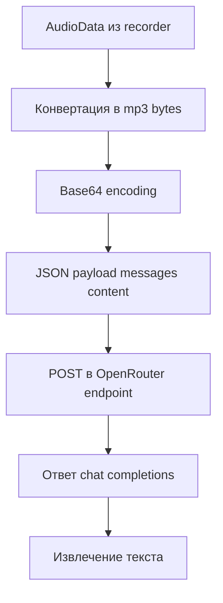

# План внедрения OpenRouter для распознавания

## Что уже выяснено

Текущее распознавание построено вокруг двух backend-ов:
- [`groq`](src/recognition/groq_api.py)
- [`openai`](src/recognition/openai_api.py)

Выбор backend-а и его параметры хранятся в [`RecognitionConfig`](src/config/settings.py), UI настраивается через [`SettingsDialog`](src/ui/settings_dialog.py), а каскад повторных попыток и fallback реализован в [`App._process_audio()`](src/main.py:400).

Пользовательское требование зафиксировано так:
- OpenRouter должен быть доступен как **ручной выбор** в настройках
- OpenRouter должен использоваться как **fallback** при ошибке основного провайдера
- Для ASR нужно добавить отдельное поле **prompt**, чтобы передавать инструкцию в модель распознавания
- В настройках нужно дать выбор **модели OpenRouter**, а по умолчанию поставить `google/gemini-3.1-flash-lite-preview`
- Ни token, ни endpoint нельзя зашивать в код приложения
- Token и endpoint должны полностью задаваться через настройки и сохраняться в [`config.yaml`](config.yaml)

## Важное уточнение по протоколу OpenRouter

OpenRouter в этом сценарии нужно подключать **не как OpenAI Whisper multipart endpoint**, а как вызов chat/completions с мультимодальным сообщением, где аудио передаётся прямо в теле JSON как `input_audio`.

Паттерн запроса зафиксирован пользователем таким:

```json
{
  "model": "google/gemini-3.1-flash-lite-preview",
  "modalities": [
    "text"
  ],
  "messages": [
    {
      "role": "user",
      "content": [
        {
          "type": "text",
          "text": "ПРОМПТ"
        },
        {
          "type": "input_audio",
          "input_audio": {
            "data": "base64-audio",
            "format": "mp3"
          }
        }
      ]
    }
  ],
  "stream": false
}
```

Это меняет архитектурное решение: OpenRouter должен жить в **отдельном recognizer-е со своей логикой сериализации аудио**, а не как тонкая копия [`OpenAIWhisperRecognizer`](src/recognition/openai_api.py).

## Архитектурное решение

Рекомендуемое решение: добавить **отдельный backend `openrouter`**.

Почему это правильно:
- у OpenRouter другой формат передачи аудио, отличный от [`OpenAIWhisperRecognizer`](src/recognition/openai_api.py:52)
- нужен отдельный HTTP payload с `messages[].content[].input_audio`
- можно явно хранить отдельные `api_key`, `base_url`, `model`, `prompt`, `audio_format`
- fallback в [`App._process_audio()`](src/main.py:400) становится прозрачным и расширяемым
- не ломается текущая логика OpenAI-совместимых прокси через [`recognition.openai.base_url`](src/config/settings.py)
- проще документировать, логировать и отлаживать

## Логика передачи audio в OpenRouter

### Как будет работать OpenRouter backend

1. Приложение получает [`AudioData`](src/audio/recorder.py) после записи.
2. Новый recognizer [`src/recognition/openrouter_api.py`](src/recognition/openrouter_api.py) кодирует аудио в **MP3 bytes**.
3. Эти байты переводятся в **base64 string**.
4. Формируется JSON payload для endpoint-а пользователя, а не multipart upload.
5. В `messages[0].content` передаются два блока:
   - текстовый блок с ASR prompt
   - аудиоблок `input_audio`
6. Ответ парсится как обычный ответ chat/completions.
7. Из ответа извлекается итоговый текст распознавания.

### Концептуальная схема



### Что именно передаётся в OpenRouter

В запросе должны участвовать настройки из [`RecognitionConfig`](src/config/settings.py):
- `recognition.openrouter.api_key`
- `recognition.openrouter.base_url`
- `recognition.openrouter.model`
- `recognition.openrouter.prompt`
- `recognition.openrouter.audio_format`

Рекомендуемый payload:

```json
{
  "model": "google/gemini-3.1-flash-lite-preview",
  "modalities": ["text"],
  "messages": [
    {
      "role": "user",
      "content": [
        {
          "type": "text",
          "text": "ASR prompt из настроек"
        },
        {
          "type": "input_audio",
          "input_audio": {
            "data": "<base64 audio>",
            "format": "mp3"
          }
        }
      ]
    }
  ],
  "stream": false
}
```

### Комментарий по логике работы

Комментарий, который стоит добавить в код рядом с OpenRouter recognizer:

- backend `openrouter` не использует `/audio/transcriptions`
- аудио не отправляется как `multipart/form-data`
- вместо этого запись кодируется в base64 и передаётся в JSON через `messages -> content -> input_audio`
- текстовое поле prompt берётся из настроек пользователя и добавляется в тот же message как блок `type=text`
- формат аудио для OpenRouter должен быть настраиваемым, но дефолтно разумно использовать `mp3`

## Целевые изменения

### 1. Конфиг и модель настроек

Изменить [`RecognitionConfig`](src/config/settings.py):
- добавить новый dataclass `OpenRouterRecognitionConfig`
- включить его в [`RecognitionConfig`](src/config/settings.py)
- расширить допустимые значения `backend`: `groq`, `openai`, `openrouter`

Поля `OpenRouterRecognitionConfig`:
- `api_key: str`
- `model: str = "google/gemini-3.1-flash-lite-preview"`
- `language: str = "ru"`
- `base_url: str = ""`
- `prompt: str = ""`
- `audio_format: str = "mp3"`

Также добавить поле `prompt` в:
- [`OpenAIRecognitionConfig`](src/config/settings.py)
- [`GroqRecognitionConfig`](src/config/settings.py)

Это даст единообразие: у каждого ASR backend-а есть своя модель, язык и prompt.

### 2. Загрузка и сохранение [`config.yaml`](config.yaml)

В [`AppSettings.load_default()`](src/config/settings.py:132) и [`AppSettings.save_default()`](src/config/settings.py:281):
- добавить чтение и сохранение секции `recognition.openrouter`
- обеспечить мягкий merge с дефолтами
- не ломать старые конфиги без этой секции
- не записывать в репозиторий никакие реальные секреты

Ожидаемая структура:

```yaml
recognition:
  backend: openrouter
  openrouter:
    api_key: ""
    model: google/gemini-3.1-flash-lite-preview
    language: ru
    base_url: ""
    prompt: ""
    audio_format: mp3
```

### 3. Новый recognizer для OpenRouter

Добавить новый модуль [`src/recognition/openrouter_api.py`](src/recognition/openrouter_api.py).

Внутри:
- класс `OpenRouterRecognizer`
- отдельный метод конвертации [`AudioData`](src/audio/recorder.py) в MP3 bytes
- кодирование MP3 в base64
- сборка JSON payload под `chat/completions`
- отправка запроса на `base_url`
- разбор ответа из `choices[0].message.content`
- поддержка случаев, когда модель вернёт:
  - обычную строку
  - список content-part объектов

Также нужны понятные ошибки для:
- пустого `base_url`
- пустого `api_key`
- 401
- 429
- некорректного JSON
- неожиданного формата ответа

### 4. Фабрика recognizer-ов

В [`create_recognizer()`](src/recognition/__init__.py:16):
- добавить поддержку backend `openrouter`
- fallback по умолчанию лучше оставить `groq`

### 5. UI настроек

Изменить [`SettingsDialog`](src/ui/settings_dialog.py):
- добавить `OpenRouter` в список выбора backend-а
- добавить отдельное поле `OpenRouter API key`
- добавить отдельное поле `OpenRouter Base URL`
- добавить отдельное поле `OpenRouter ASR model`
- добавить отдельное поле `OpenRouter ASR prompt`
- при необходимости добавить поле `OpenRouter Audio Format`

Также для консистентности добавить prompt-поля для текущих backend-ов:
- `Groq ASR prompt`
- `OpenAI ASR prompt`
- `OpenRouter ASR prompt`

И отдельная заметка в UI или README:
- OpenRouter передаёт аудио как base64 `input_audio` внутри chat/completions запроса

### 6. Применение настроек из UI

В [`SettingsDialog._load_from_settings()`](src/ui/settings_dialog.py:263):
- загрузить значения `recognition.openrouter.*`
- загрузить `prompt` для всех ASR backend-ов

В [`SettingsDialog._build_new_settings()`](src/ui/settings_dialog.py:325):
- сохранить `openrouter.api_key`
- сохранить `openrouter.base_url`
- сохранить `openrouter.model`
- сохранить `openrouter.prompt`
- сохранить `openrouter.audio_format`
- сохранить `prompt` у Groq/OpenAI

### 7. Fallback-каскад распознавания

Сейчас в [`App._process_audio()`](src/main.py:427) жёстко зашит список:
- `groq`
- `openai`

Нужно изменить это на расширяемый порядок, включающий `openrouter`.

Рекомендуемая логика:
1. первым идёт выбранный пользователем `recognition.backend`
2. затем остальные backend-ы в фиксированном резервном порядке
3. OpenRouter должен быть первым fallback, если он не выбран основным

Практический резервный порядок:
- базовый список: `['openrouter', 'groq', 'openai']`
- выбранный backend перемещается в начало
- дубли убираются

Примеры:
- если выбран `groq` → `['groq', 'openrouter', 'openai']`
- если выбран `openai` → `['openai', 'openrouter', 'groq']`
- если выбран `openrouter` → `['openrouter', 'groq', 'openai']`

### 8. Проверка наличия ключа и UX при первом запуске

В [`App.__init__()`](src/main.py:123) сейчас проверяется отсутствие ключа только для `groq` и `openai`.

Нужно расширить это на `openrouter`, чтобы предупреждение работало для всех трёх backend-ов.

### 9. Логирование и диагностика

Нужно, чтобы в логах различались:
- backend: `groq`, `openai`, `openrouter`
- модель распознавания
- был ли передан ASR prompt
- формат аудио для OpenRouter
- какой backend реально сработал после fallback

Это особенно важно в [`App._process_audio()`](src/main.py:400) и в новом recognizer-е [`openrouter_api.py`](src/recognition/openrouter_api.py).

### 10. Документация комментариями в коде

Нужно добавить понятные комментарии в код:
- в [`src/recognition/openrouter_api.py`](src/recognition/openrouter_api.py) объяснить, почему используется JSON `input_audio`, а не multipart
- в [`src/config/settings.py`](src/config/settings.py) кратко описать назначение `prompt` и `audio_format`
- в [`src/ui/settings_dialog.py`](src/ui/settings_dialog.py) подписать поле prompt так, чтобы было понятно: это инструкция для распознавания, а не для постобработки

## Рекомендуемый список работ для режима реализации

- [ ] Добавить `OpenRouterRecognitionConfig` и поле `prompt` для всех ASR backend-ов в [`src/config/settings.py`](src/config/settings.py)
- [ ] Добавить поле `audio_format` для backend `openrouter` в [`src/config/settings.py`](src/config/settings.py)
- [ ] Расширить загрузку и сохранение [`config.yaml`](config.yaml) секцией `recognition.openrouter`
- [ ] Создать новый модуль [`src/recognition/openrouter_api.py`](src/recognition/openrouter_api.py) с JSON `input_audio` payload
- [ ] Обновить фабрику [`create_recognizer()`](src/recognition/__init__.py:16) для backend `openrouter`
- [ ] Обновить [`SettingsDialog`](src/ui/settings_dialog.py) новыми полями OpenRouter и ASR prompt
- [ ] Обновить [`App.__init__()`](src/main.py:55) для проверки ключа OpenRouter
- [ ] Обновить fallback-каскад в [`App._process_audio()`](src/main.py:400) с поддержкой `openrouter`
- [ ] Обновить дефолтную генерацию конфига в [`App._load_or_init_settings()`](src/main.py:735)
- [ ] Добавить кодовые комментарии про схему передачи `input_audio`
- [ ] Проверить совместимость с текущим [`config.yaml`](config.yaml) без ручной миграции
- [ ] Протестировать сценарии основной backend + fallback и передачу ASR prompt

## Итог

План теперь учитывает реальный протокол OpenRouter: аудио передаётся не как файл multipart, а как `input_audio` в JSON payload для chat/completions. Значит OpenRouter нужно внедрять как отдельный backend с собственной логикой сериализации аудио, отдельными настройками token endpoint model prompt и поддержкой fallback.
